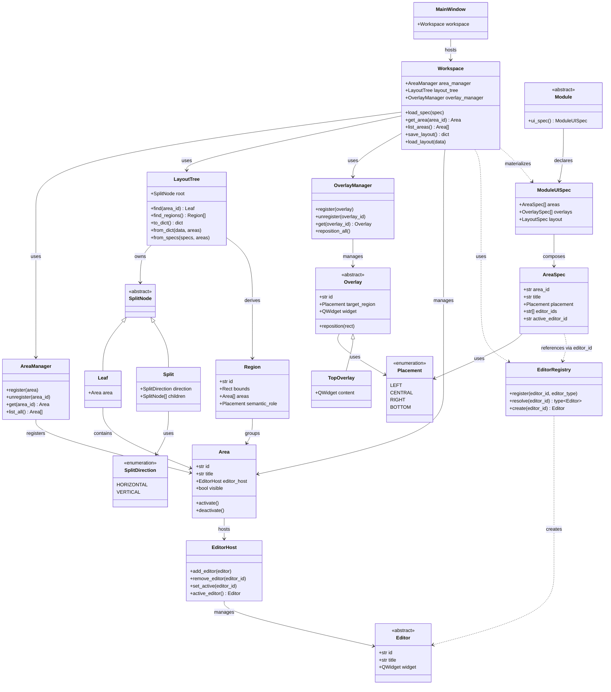

# Workspace

## 1. Concept

The **Workspace** is the runtime environment where clinical work happens.

It is not a single widget nor a single class. It is a *composition* of
**Areas** — generic containers that host **Editors** — and **Overlays** —
floating layers that cover regions of Areas.

### 1.1 What the Workspace is

- A **container** that hosts one or more Areas.
- A **layout coordinator** that arranges Areas in a split tree.
- A **lifecycle manager** for Areas (registration, activation, removal).
- An **Overlay manager** — floating layers over regions.
- A **configuration target** whose layout can be persisted per project.
- A **materializer** of UI compositions declared by Modules.

### 1.2 The single rule

> **The Workspace hosts Areas and Overlays. Nothing else.**

If something is not an `Area` and not an `Overlay`, the Workspace does
not know it exists. Editors, Toolbars, Tools and Modules are all
invisible to the Workspace.

### 1.3 Module declares; Workspace materializes

> **The Module declares the UI composition. The Workspace materializes
> that declaration.**

The Module **does not own** Areas or Editors. It only describes what it
wants through a `ModuleUISpec`.

The Workspace receives this declaration and **materializes** it:

- Resolves `editor_id` values in the `EditorRegistry`.
- Creates Editor instances.
- Creates Areas.
- Builds the `LayoutTree`.
- Renders into Qt widgets.
- Positions Overlays.

The Workspace **does not know the Module.** It only receives the
specification. This preserves the rule from §1.2.

---

## 2. Core Concept: Area

An **Area** is the fundamental building block of the Workspace.

This is Principle #7 (*Panels Are Areas*): there are no `SidePanel`,
`BottomPanel`, `CentralArea` or `ToolbarArea` classes. There is only
`Area`.

### 2.1 What an Area is

An Area is a **generic UI container**. It:

- Has a **stable identifier** (e.g., `area.left`, `area.central`).
- Has a **title** (user-facing, translatable via i18n).
- **Hosts an `EditorHost`** (which in turn hosts one or more Editors).
- Has a **visibility state** (shown/hidden).
- Is **positioned by the layout tree**, never by itself.

**The Area does not store `placement`.** The `placement` is construction
metadata of the `AreaSpec`. Once the tree is built, it is no longer
consulted.

### 2.2 What an Area is NOT

- It is **not** an Editor. An Editor is a widget that an Area may host.
- It is **not** an `EditorHost`. The `EditorHost` is an internal
  component of the Area (see `editors.md`).
- It is **not** a Toolbar. A Toolbar is a widget inside an Editor.
- It is **not** a Module. A Module declares which Areas it wants the
  Workspace to materialize.
- It is **not** a state holder. State lives in the Scene.
- It does **not** know the purpose of its content. It only knows it
  hosts an `EditorHost`.
- It does **not** create the `EditorHost` nor the Editors it hosts.

### 2.3 Area lifecycle

```text
created → registered → placed → activated → deactivated → unregistered → destroyed
```

| State | Meaning |
|---|---|
| **created** | Instance exists, not yet in the Workspace. |
| **registered** | Known to the AreaManager. |
| **placed** | Assigned to a position in the layout tree. |
| **activated** | Visible and receiving user input. |
| **deactivated** | Hidden but still registered. |
| **unregistered** | Removed from the AreaManager. |
| **destroyed** | Instance disposed. |

The `EditorHost` and Editor lifecycle is **separate** (see
`editors.md`).

---

## 3. Workspace Architecture

### 3.1 High-level composition

The Workspace is a **split tree of Areas**, not a fixed set of panels.

```text
+-------------------------------------------------------+
|                     MainWindow                        |
+-------------------------------------------------------+
|                                                       |
|  +----------+----------------------+----------+       |
|  | Area     | Area                 | Area     |       |
|  | left     | central              | right    |       |
|  +----------+----------------------+----------+       |
|                                                       |
|  +---------------------------------------------------+|
|  | Area — bottom                                     ||
|  +---------------------------------------------------+|
+-------------------------------------------------------+
```

Every visible rectangle is an **Area**. The **tree structure** (which
Areas exist and how they are arranged) is **data**, not code.

The Workspace **does not define** a default layout. It is an **empty
skeleton** until a Module declares the UI composition it wants.

Who decides how many and which Areas exist is the **Module loaded by
the Flow**:

| Module | UI composition |
|---|---|
| Patient | `[central]` |
| 3D Mesh Editing | `[left, central, right]` |
| Tomography | `[left, central, right, bottom]` |

When a Module is selected, the Workspace builds the tree from those
declarations. The tree is the single source of truth for the layout.

For the composition declaration model, see §3.5.

For the tree implementation, see §5.

For the Overlay model, see §7.

### 3.2 Relationship diagram



**Key points:**

- The `Workspace` knows `Area`, `AreaManager`, `LayoutTree`,
  `OverlayManager` and `EditorRegistry`.
- The `Workspace` has **no** reference to `Scene`, `Editor`, `Toolbar`
  or `Module`.
- The `Workspace` **materializes** a `ModuleUISpec`, but does not know
  the `Module`.
- `AreaSpec` **references** Editors via `editor_id` (string), not via
  concrete class.
- The `EditorRegistry` resolves `editor_id` to the concrete class and
  creates instances.
- `Area` is a **concrete class**.
- `EditorHost` is an internal component of the Area (see `editors.md`).
- `Editor` is an **abstract class**.
- The `LayoutTree` is an **N-ary tree** of `Leaf` and `Split` nodes.
- A **Region** is **derived geometrically** from the `LayoutTree`.
- An **Overlay** covers a Region.

### 3.3 Application chrome

Some visual elements are **not** Areas nor Overlays:

- The native **OS menu bar** (if any).
- Native window controls (if not embedded in the Top Bar).

These belong to the `MainWindow`.

**There is no status bar.** The traditional status bar role is served
by the Console Area (bottom), when the Module declares it.

The Workspace does not know these elements exist. This preserves the
rule stated in §1.2.

For details on the **Top Bar** (Upper Panel) and its 3 segments, see
`top-bar.md`.

### 3.4 Data flow

The Workspace does not mutate clinical state. It only presents it.

```text
User action
    |
    v
Editor (inside an EditorHost, inside an Area)
    |
    | builds
    v
Command
    |
    | publishes to
    v
CommandBus
    |
    | executes
    v
Scene (mutation)
    |
    | emits
    v
EventBus
    |
    | notifies
    v
Editors
    |
    | redraw
    v
User sees the update
```

**Read/write separation:**

- **Read:** the Editor accesses the Scene via `SceneProvider` (injected
  in the constructor). The `SceneProvider` exposes a read-only API.
- **Write:** the Editor publishes `Command`s to the `CommandBus`.
  It never mutates the Scene directly.

This keeps the Scene as the **single source of truth**, without
exposing direct mutation to Editors.

See `commands.md` and `scene.md` (to be written).

### 3.5 The Module declares the UI composition

The Workspace **does not decide** which Areas exist. Each Module
declares its **UI composition** through a `ModuleUISpec`.

```python
@dataclass(frozen=True)
class ModuleUISpec:
    areas: list[AreaSpec]
    overlays: list[OverlaySpec]
    layout: LayoutSpec | None = None

@dataclass(frozen=True)
class AreaSpec:
    area_id: str
    title: str
    placement: Placement
    editor_ids: list[str]                # Editor IDs
    active_editor_id: str | None = None  # which one starts active
```

**Important points:**

- `Placement` is **construction metadata**. Used by the `LayoutBuilder`
  to build the tree. Once built, it is no longer consulted.
- `AreaSpec` declares Editors via **`editor_ids`** — strings, not
  concrete classes.
- The Module **does not import** the Editor classes.
- The `EditorRegistry` resolves the IDs to concrete classes.

**Example:**

```text
Module "3D Mesh Editing" declares:
    ModuleUISpec(
        areas=[
            AreaSpec("area.left",    "Toolbox",    ["editor.toolbox"]),
            AreaSpec("area.central", "Viewport",   ["editor.viewport_3d"]),
            AreaSpec("area.right",   "Properties", ["editor.properties"]),
        ],
    )

Workspace materializes:
    - Resolves "editor.toolbox"     → ToolboxEditor
    - Resolves "editor.viewport_3d" → Viewport3DEditor
    - Resolves "editor.properties"  → PropertiesEditor
    - Creates the 3 instances
    - Creates the 3 Areas
    - Builds: Split(HORIZONTAL)[Leaf(left), Leaf(central), Leaf(right)]
```

If the Module declares only `[area.central]`:

```text
Leaf(area.central)
```

If the Module declares `[left, central, right, bottom]`:

```text
Split(VERTICAL)
├── Split(HORIZONTAL)[Leaf(left), Leaf(central), Leaf(right)]
└── Leaf(bottom)
```

**Placement rules:**

- `CENTRAL` — always exists; it is the center of the tree.
- `LEFT` — flanks the central on the left.
- `RIGHT` — flanks the central on the right.
- `BOTTOM` — sits below the horizontal row.

**Constraint:** a `ModuleUISpec` must declare at least `CENTRAL`. If it
does not, the Workspace rejects the load with a clear error.

**Switching Modules:** when another Module is selected, the Workspace
receives a new `ModuleUISpec` and **discards the current tree**. Areas
with the same `area_id` **may be reused** if the declared `editor_ids`
are compatible (see §6.4).

### 3.6 EditorRegistry

The **`EditorRegistry`** is the component that resolves `editor_id` to
concrete Editor implementations.

```python
class EditorRegistry:
    def register(self, editor_id: str, editor_type: type[Editor]) -> None: ...
    def resolve(self, editor_id: str) -> type[Editor]: ...
    def create(self, editor_id: str) -> Editor: ...
```

**Responsibilities:**

- **Register** Editor implementations (system, Modules, Plugins).
- **Resolve** an `editor_id` to the corresponding `type[Editor]`.
- **Create** instances on demand.

**Why it exists:**

- The Module **does not need to import** the concrete Editor classes.
- It only needs to declare `editor_id` (string).
- Plugins can register new Editors without changing the Workspace code.

**Registry population:**

- **System Editors** register at boot.
- **Modules** register their Editors when loaded.
- **Plugins** register their Editors when activated.

---

## 4. Editor

All content of an Area is managed by an **`EditorHost`**. The
`EditorHost` hosts one or more **Editors**.

There is no distinction between "Viewport", "Panel" or "Editor". They
are all Editors. They all live in `ui/editors/`.

For full details on `EditorHost`, the Editor lifecycle and the Editor
catalog, see `editors.md`.

### 4.1 What an Editor is

An Editor is a widget that:

- Renders or edits a specific type of content.
- Receives Scene events via `SceneProvider` (read).
- Emits user intent via `Command` (write).
- May have its own internal toolbar (local Editor chrome).

The Workspace **does not know** what an Editor does. The `EditorHost`
manages it; the Area hosts it indirectly.

### 4.2 Available Editors

The system keeps a **global Editor catalog**, organized by category:

| Category | Editors |
|---|---|
| **View** | `Viewport3DEditor`, `MPRViewerEditor` |
| **Mesh** | `MeshEditor`, `NodeEditor` |
| **Data** | `PropertiesEditor`, `SceneEditor`, `DocumentEditor` |
| **Console** | `ConsoleEditor` |
| **Aux** | `AIConsoleEditor`, `HistoryEditor`, `AnimationEditor` |

The catalog is populated by:

- **System Editors** (built-in, always available).
- **Editors registered by Modules**.
- **Editors registered by Plugins**.

### 4.3 Where an Editor sits

**The Editor does not decide where it sits.** The `EditorHost` manages
it; the Area hosts it indirectly.

**The Area does not create the Editor either.** It hosts an
`EditorHost`. The `EditorHost` receives the Editors already created by
the system.

**Who decides which Editor goes in which Area:**

1. **The Module**, when declaring its `AreaSpec`. Each `AreaSpec`
   declares the `editor_ids` that the Area should host initially.
2. **The user**, when adding an Editor to an existing Area.
3. **The `ModuleUISpec`**, when declaring which Editors each Area
   should host initially.

**Typical conventions** (not rules):

| Editor | Where it typically sits |
|---|---|
| `PropertiesEditor` | Right or Bottom Area |
| `ConsoleEditor` | Bottom Area |
| `NodeEditor` | Central Area |
| `Viewport3DEditor` | Central Area |
| `MPRViewerEditor` | Central Area |

**Nothing in the system imposes** these conventions.

**Instance policy:** each Editor is a **new instance**. Two
`Viewport3DEditor` are two independent instances.

### 4.4 Toolbars

A toolbar is an **internal widget of an Editor**, not an Area.

Each Editor decides whether it wants its own toolbar. The Workspace
never hosts toolbars.

### 4.5 Adding an Editor

The user can add an Editor through:

- **`+` button** on the Area chrome or on the `EditorHost` tab bar.
- **Keyboard shortcut**.
- **Context menu**.

Flow:

1. The system opens the available **Editor catalog**.
2. The user chooses an Editor.
3. The system **creates a new instance** of the chosen Editor.
4. The `EditorHost` **adds the new Editor** to the list.
5. The new tab (if ≥ 2 Editors) appears and becomes active.

**Nothing is destroyed.** The original Area keeps existing; the new
Editor is **additional** inside the same `EditorHost`.

### 4.6 Switching the active Editor

The user can **switch** between the Editors of an `EditorHost`:

1. The `EditorHost` does `detach` of the current Editor (without
   destroying it).
2. The `EditorHost` does `attach` of the new Editor.
3. The new Editor is initialized with the current Scene.
4. The change is recorded as a `Command`.

**Note:** switching the **active** Editor is different from
**removing** an Editor. Removing is done via the `❌` on the tab.

For details, see `editors.md`.

---

## 5. Layout Model — N-ary Split Tree

### 5.1 The model

The Workspace layout is an **N-ary tree**.

- A **`Leaf`** contains exactly one `Area`.
- A **`Split`** contains **two or more** child nodes, and a
  **direction** (horizontal or vertical).

```text
Split(VERTICAL)
├── Split(HORIZONTAL)
│   ├── Leaf(Area left)
│   ├── Leaf(Area central)
│   └── Leaf(Area right)
└── Leaf(Area bottom)
```

**This is the only layout mechanism.** There are no slots, no
predefined templates, no grid.

### 5.2 Initial state

The Workspace **starts empty**. There is no pre-built tree.

The first tree is built when the first Module is loaded, from the
`ModuleUISpec` (see §3.5).

**Examples:**

**Patient Module** (`[central]`):

```text
Leaf(area.central)
```

**3D Mesh Editing Module** (`[left, central, right]`):

```text
Split(HORIZONTAL)
├── Leaf(area.left)
├── Leaf(area.central)
└── Leaf(area.right)
```

**Tomography Module** (`[left, central, right, bottom]`):

```text
Split(VERTICAL)
├── Split(HORIZONTAL)
│   ├── Leaf(area.left)
│   ├── Leaf(area.central)
│   └── Leaf(area.right)
└── Leaf(area.bottom)
```

**The user can hide and re-show** the Areas the Module declared. This
is done via buttons on the application chrome (it is not
creating/destroying Areas — it is only showing/hiding).

**The user can add** new Areas through the `+` button (see §4.5).

### 5.3 Resizing

Each `Split` is rendered as a `QSplitter`. The user can **drag the
dividers** to resize adjacent Areas.

- Sizes are **relative**.
- Initial sizes are set once, when the tree is built.
- Resizing **does not** change the tree structure — only the
  proportions.

### 5.4 Rendering

Rendering the tree into Qt widgets is the responsibility of the
**`LayoutRenderer`**.

The `LayoutTree` is a **pure data model**, with no Qt dependency. The
`LayoutRenderer` is the **Anti-Corruption Layer** between the model
and Qt.

**The `LayoutRenderer` keeps rendering state:**

```python
class LayoutRenderer:
    _split_widgets: dict[int, QSplitter]   # id(SplitNode) → QSplitter
    _area_widgets: dict[str, Area]         # area_id → Area (widget)
```

This state is a **cache** — it is not a source of truth. It can be
discarded and rebuilt from the `LayoutTree` at any time.

**Rules:**

- The `LayoutTree` is the **single source of truth** for structure.
- The `LayoutRenderer` **never invents** structure.
- If there is a divergence, the tree wins.

### 5.5 Persistence

The tree is serialized as nested JSON:

```json
{
  "type": "split",
  "direction": "vertical",
  "children": [
    {
      "type": "split",
      "direction": "horizontal",
      "children": [
        { "type": "leaf", "area_id": "area.left" },
        { "type": "leaf", "area_id": "area.central" },
        { "type": "leaf", "area_id": "area.right" }
      ]
    },
    { "type": "leaf", "area_id": "area.bottom" }
  ]
}
```

This JSON is stored inside the project file, not in user settings.

**Precedence when opening a project:**

1. **Persisted layout** in the project (most specific).
2. **Default layout** declared by the Module.
3. **System fallback** (single central).

If the persisted layout is **incompatible** with the current Module,
the Workspace discards it and rebuilds from the Module.

### 5.6 Why an N-ary tree

- **Simple:** two node types.
- **Recursive:** each subtree is a complete layout.
- **Composable:** any Area can be split; any split can be closed.
- **Persistable:** JSON maps directly to the tree.
- **No slots:** positions emerge from the tree.
- **Direct mapping to Qt:** each `Split` is rendered as a `QSplitter`;
  each `Leaf` as an `Area`.

This mirrors how **tmux**, **VSCode**, **Blender** and **3D Slicer**
implement panel layouts.

### 5.7 Evolution

The tree model is **stable**. Future operations:

- `split` and `close` of nodes.
- Drag-and-drop to reorder Leaves.
- Floating Areas.
- Predefined trees.
- Multiple Workspaces.

**None of these operations changes the tree model.**

---

## 6. Workspace Lifecycle

### 6.1 Startup

```text
QApplication starts
    |
    v
MainWindow created
    |
    v
Workspace created (empty — no tree)
    |
    v
Modules loaded via ModuleRegistry
    |
    v
Initial Flow is selected
    |
    v
First Module is loaded
    |
    v
Workspace reads the Module's ModuleUISpec
    |
    v
LayoutBuilder builds the tree from the ModuleUISpec
    |
    v
LayoutRenderer renders the tree as nested QSplitters
    |
    v
Workspace positions Overlays over Regions
    |
    v
Workspace shown to the user
```

### 6.2 Opening a project

```text
Project opened
    |
    v
Scene loaded from JSON
    |
    v
Project Flow is selected
    |
    v
Flow Module is loaded
    |
    v
Persisted layout is loaded from the project (if it exists)
    |
    v
If the persisted layout is compatible with the ModuleUISpec:
    Workspace uses the loaded layout
Else:
    LayoutBuilder builds the tree from the ModuleUISpec
    |
    v
LayoutRenderer renders the tree
    |
    v
Workspace positions Overlays over Regions
    |
    v
Editors inside Areas redraw from Scene state
```

### 6.3 Shutdown

```text
User closes the window
    |
    v
Workspace serializes the tree
    |
    v
Scene saved (if dirty)
    |
    v
QApplication exits
```

### 6.4 Module switch

```text
User selects another Module
    |
    v
Workspace discards the current tree
    |
    v
For each AreaSpec of the new ModuleUISpec:
    If an Area is registered with the same area_id
    And the declared editor_ids are compatible:
        Reuse the instance
    Else:
        Create a new Area
    |
    v
LayoutBuilder builds the new tree
    |
    v
LayoutRenderer renders the new tree
    |
    v
Workspace repositions Overlays
```

**Explicit reuse rule:**

> An Area is **reused** only when the `area_id` is the same **and**
> the declared `editor_ids` are compatible.
>
> Otherwise, the Area is **reconfigured** (Editors swapped) or
> **replaced**.

This avoids reuse with incompatible Editors.

---

## 7. Overlays

### 7.1 Concept

An **Overlay** is a **floating layer** that the Workspace positions
over a **Region** of Areas.

The Overlay:

- **Does not interfere with the layout** — it floats over the Areas.
- **Is not an Area.** It is not hosted by any Area.
- **Is managed by the Workspace** (via `OverlayManager`).

### 7.2 Regions

A **Region** is a **geometric area derived** from the `LayoutTree`
that groups a set of related Areas.

The Region is **computed** from the rendered Areas (bounding boxes).
The `LayoutTree` exposes `find_regions()` which returns the Regions.

**The Region is NOT defined by `Placement`.** The `Placement` is only
a **convention** that helps identify semantic regions when they exist.
The Region itself is **geometric**.

```python
@dataclass
class Region:
    id: str                # "central", "left", "right", "bottom"
    bounds: Rect           # rectangle that contains the Region
    areas: list[Area]      # Areas that belong to the Region
    semantic_role: Placement | None   # convention, optional
```

**Why geometric and not semantic?**

- Allows arbitrary splits (the Central Region may be 2×2, 3×1, etc).
- Allows floating areas.
- Allows multiple Workspaces.
- Allows drag-and-drop.
- Allows lateral overlays.

`Placement` still exists, but as a **semantic identifier** ("this
Region is the Central one"), not as the definer of the Region.

### 7.3 The Upper Panel

The **Upper Panel** is an Overlay of the **Central Region**.

It:

- Is anchored to the **top** of the Central Region.
- Has the **width** of the Central Region (with fixed side margins).
- Floats **over** the Central Areas.
- Does not push content — it overlaps.
- Is **a single unit**, independent of the number of Central Areas.

```text
+-----------+-----------------------------------+----------+
|           |  ┌─────────────────────────────┐  |          |
| Area Left |  │       Upper Panel           │  | Area Right|
|           |  └─────────────────────────────┘  |          |
|           |                                   |          |
|           |         Central Region            |          |
|           |                                   |          |
+-----------+-----------------------------------+----------+
|                    Bottom Area                           |
+----------------------------------------------------------+
```

**The Central Region may have N Areas inside.** The Upper Panel
covers all of them as a single unit.

### 7.4 Computing the bounds

The Workspace computes the Central Region bounds from the rendered
Areas:

```python
x_min = right_edge_of(Region.LEFT)   or  0
x_max = left_edge_of(Region.RIGHT)   or  workspace_width
y_min = 0
y_max = top_edge_of(Region.BOTTOM)   or  workspace_height
```

The Upper Panel is positioned at:

- `x` = `x_min + margin`
- `y` = `y_min + margin_top`
- `width` = `(x_max - x_min) - 2 * margin`
- `height` = fixed

### 7.5 Content: the three segments

The Upper Panel is **a single panel** that behaves as **three
independent segments**:

```text
+---------------------------------------------------------------------------+
| [Left]                        [Center]                     [Right]        |
+---------------------------------------------------------------------------+
```

| Segment | Alignment | Typical content |
|---|---|---|
| **Left** | Anchored left | Menu, Home, context title, Left toggle |
| **Center** | Centered | Active Editor tools, `+` |
| **Right** | Anchored right | Extras, Right toggle, window controls |

**Each segment has its own width** (based on content). The segments
**do not push each other** — empty spaces fill the rest.

**Each segment responds to width independently**, collapsing as
available space shrinks.

**Visual effect:** the Upper Panel has **frosted glass** (blur + tint)
in the background, capturing the Central Region content behind it.

For full details on the Top Bar (3 segments, responsiveness, glass
effect), see `top-bar.md`.

### 7.6 When the layout changes

Whenever the layout changes (new Module, split, window resize,
visibility of lateral Areas), the Workspace:

1. Recomputes the bounds of each Region.
2. Repositions the Overlays.

The Overlay is **reactive**.

### 7.7 Other Overlays

In the future, other Overlays may be added:

- **Lower Panel** (Central Region overlay, anchored to the bottom).
- **Lateral overlays** (LEFT, RIGHT).
- **Floating overlays**.

For now, the **Upper Panel** is the only defined Overlay.

### 7.8 Persistence

The presence and configuration of Overlays are persisted with the
tree layout, inside the project file. Non-persisted Overlays fall back
to the Module default.

---

## 8. Open Questions

### 8.1 Is the layout per-project or per-user?

**Option A:** Per-project.
**Option B:** Per-user.
**Option C:** Hybrid.

**Current lean:** Option C.

### 8.2 Does the global Area catalog exist?

**Option A:** Yes — the user can open any system Editor.
**Option B:** No — only what the Module declared.

**Current lean:** Option A.

### 8.3 How to handle floating Areas on multi-monitor?

Requires extra handling (Qt handles most of it, but VTK viewports
need care).

**Current lean:** define when multi-monitor support enters scope.

### 8.4 Can two Areas show the same Editor?

**Option A:** No — each Editor is an independent instance.
**Option B:** Yes — useful to compare two views of the same data.

**Current lean:** Option A.

### 8.5 Where does the "active Area" concept live?

**Option A:** The Workspace tracks the active Area.
**Option B:** Each Area tracks its own focus.

**Current lean:** Option A, with per-Area focus as a secondary concept.
