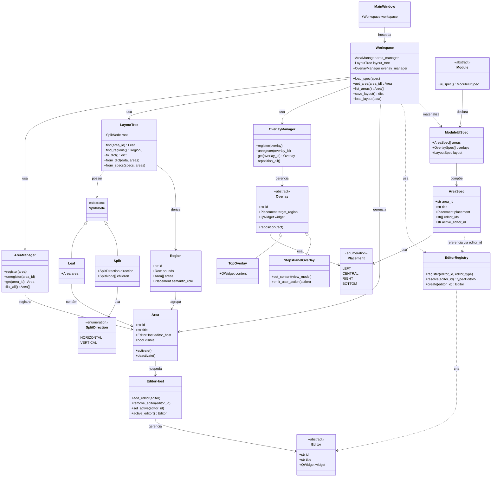

# Workspace

## 1. Conceito

O **Workspace** é o ambiente de execução onde o trabalho clínico acontece.

Não é um único widget nem uma única classe. É uma *composição* de **Areas** — containers genéricos que hospedam **Editores**, e de **Overlays** — camadas flutuantes que cobrem regiões de Areas.

### 1.1 O que o Workspace é

- Um **container** que hospeda uma ou mais Areas.
- Um **coordenador de layout** que organiza as Areas em uma árvore de splits.
- Um **gerenciador de ciclo de vida** das Areas (registro, ativação, remoção).
- Um **gerenciador de Overlays** — camadas flutuantes sobre regiões.
- O host do **Painel de Etapas (`steps_panel`)**, uma Overlay persistente que apresenta o fluxo clínico ativo.
- Um **alvo de configuração** cujo layout pode ser persistido por projeto.
- Um **materializador** de composições de UI declaradas por Módulos.

### 1.2 A regra única

> **O Workspace hospeda Areas e Overlays. Nada mais.**

Se algo não é uma `Area` nem uma `Overlay`, o Workspace não sabe que existe. Editores, Toolbars, Tools, Módulos e Flows são todos invisíveis ao Workspace. O `steps_panel` é uma Overlay da UI da workspace; seu conteúdo e estado são fornecidos pela camada de aplicação que executa o Flow.

### 1.3 Módulo declara; Workspace materializa

> **O Módulo declara a composição de UI. O Workspace materializa essa declaração.**

O Módulo **não possui** Areas nem Editores. Ele apenas descreve o que quer, através de um `ModuleUISpec`. A composição do módulo não define nem substitui a sequência global de etapas do Flow.

O Workspace recebe essa declaração e **materializa**:

- Resolve os `editor_id` no `EditorRegistry`.
- Cria as instâncias dos Editores.
- Cria as Areas.
- Constrói a `LayoutTree`.
- Renderiza em widgets Qt.
- Posiciona as Overlays.

O `steps_panel` é mantido como Overlay compartilhada durante as trocas de módulo. A cada troca, a Workspace materializa o novo `ModuleUISpec` sem reconstruir ou reiniciar o progresso do painel.

O Workspace **não conhece o Módulo.** Ele apenas recebe a especificação. Isso preserva a regra de §1.2.

Overlays declaradas no `ModuleUISpec` são específicas daquele Módulo e acompanham a composição que ele fornece. Overlays compartilhadas da interface da Workspace, como o `steps_panel`, são registradas fora do `ModuleUISpec` e permanecem durante a troca de Módulo.

---

## 2. Conceito Central: Area

Uma **Area** é o bloco fundamental de construção do Workspace.

Este é o Princípio #7 (*Painéis São Areas*): não existem classes `SidePanel`, `BottomPanel`, `CentralArea` ou `ToolbarArea`. Existe apenas `Area`.

### 2.1 O que uma Area é

Uma Area é um **container genérico de UI**. Ela:

- Possui um **identificador estável** (ex.: `area.left`, `area.central`).
- Possui um **título** (para o usuário, traduzível por i18n).
- **Hospeda um `EditorHost`** (que, por sua vez, hospeda um ou mais Editores).
- Possui **estado de visibilidade** (mostrada/oculta).
- É **posicionada pela árvore de layout**, nunca por si mesma.

**A Area não armazena `placement`.** O `placement` é metadado de construção do `AreaSpec`. Uma vez construída a árvore, ele não é mais consultado.

### 2.2 O que uma Area NÃO é

- **Não** é um Editor. Um Editor é um widget que uma Area pode hospedar.
- **Não** é um `EditorHost`. O `EditorHost` é um componente interno da Area (ver `editors.md`).
- **Não** é uma Toolbar. Uma Toolbar é um widget dentro de um Editor.
- **Não** é um Módulo. Um Módulo declara quais Areas deseja que o Workspace materialize.
- **Não** é um detentor de estado. O estado vive na Scene.
- **Não** sabe o propósito do seu conteúdo. Ela só sabe que hospeda um `EditorHost`.
- **Não** cria o `EditorHost` nem os Editores que ele hospeda.

### 2.3 Ciclo de vida da Area

```text
criada → registrada → posicionada → ativada → desativada → desregistrada → destruída
```

| Estado | Significado |
|---|---|
| **criada** | Instância existe, ainda não está no Workspace. |
| **registrada** | Conhecida pelo AreaManager. |
| **posicionada** | Atribuída a uma posição na árvore de layout. |
| **ativada** | Visível e recebendo input do usuário. |
| **desativada** | Oculta mas ainda registrada. |
| **desregistrada** | Removida do AreaManager. |
| **destruída** | Instância descartada. |

O ciclo de vida do `EditorHost` e dos Editores é **separado** (ver `editors.md`).

---

## 3. Arquitetura do Workspace

### 3.1 Composição de alto nível

O Workspace é uma **árvore de splits de Areas**, não um conjunto fixo de painéis.

```text
+-------------------------------------------------------+
|                     MainWindow                        |
+-------------------------------------------------------+
|                                                       |
|  +----------+----------------------+----------+       |
|  | Area     | Area                 | Area     |       |
|  | left     | central              | right    |       |
|  +----------+----------------------+----------+       |
|                                                       |
|  +---------------------------------------------------+|
|  | Area — bottom                                     ||
|  +---------------------------------------------------+|
+-------------------------------------------------------+
```

Cada retângulo visível é uma **Area**. A **estrutura da árvore** (quais Areas existem e como estão arranjadas) é **dado**, não código.

O Workspace **não define** um layout padrão. Ele é um **esqueleto vazio** até que um Módulo declare a composição de UI que deseja.

Quem decide quantas e quais Areas existem é o **Módulo carregado pelo Flow**:

| Módulo | Composição de UI |
|---|---|
| Paciente | `[central]` |
| Edição 3D de Malha | `[left, central, right]` |
| Tomografia | `[left, central, right, bottom]` |

Ao receber a composição de um Módulo, o Workspace constrói a árvore a partir dessas declarações. A árvore é a única fonte de verdade do layout. A ativação do Módulo é coordenada pela camada de aplicação; o Workspace recebe o `ModuleUISpec` e permanece sem conhecimento do Módulo ou do Flow que o selecionou.

No fluxo clínico, o Flow define uma sequência única de etapas em JSON, normalmente com uma etapa associada a um Módulo. O motor do Flow, na camada de aplicação e implementado em Python, avalia requisitos e solicita à aplicação que ative o Módulo da próxima etapa. A aplicação carrega o Módulo e encaminha seu `ModuleUISpec` ao Workspace. O Workspace apenas materializa essa composição. O `steps_panel` permanece como Overlay compartilhada, exibindo a mesma sequência durante as trocas de Módulo.

Para o modelo de declaração da composição, ver §3.5.

Para a implementação da árvore, ver §5.

Para o modelo de Overlays, ver §7.

### 3.2 Diagrama de relacionamento



**Pontos-chave:**

- O `Workspace` conhece `Area`, `AreaManager`, `LayoutTree`, `OverlayManager` e `EditorRegistry`.
- O `Workspace` **não** tem referência a `Scene`, `Editor`, `Toolbar` ou `Module`.
- O `Workspace` **materializa** um `ModuleUISpec`, mas não conhece o `Module`.
- `AreaSpec` **referencia** Editores via `editor_id` (string), não via classe concreta.
- O `EditorRegistry` resolve `editor_id` para a classe concreta e cria instâncias.
- `Area` é uma **classe concreta**.
- `EditorHost` é um componente interno da Area (ver `editors.md`).
- `Editor` é uma **classe abstrata**.
- A `LayoutTree` é uma **árvore N-ária** de nós `Leaf` e `Split`.
- Uma **Região** é **derivada geometricamente** da `LayoutTree`.
- Uma **Overlay** cobre uma Região.
- O `steps_panel` é implementado como uma Overlay compartilhada da UI da Workspace. O Workspace gerencia seu ciclo de vida e posicionamento como qualquer Overlay; a aplicação fornece seu estado de apresentação e recebe suas ações.

### 3.3 Chrome da aplicação

Alguns elementos visuais **não** são Areas nem Overlays:

- A **barra de menu nativa do SO** (se houver).
- Controles de janela nativos (se não estiverem incorporados na Top Bar).

Esses pertencem à `MainWindow`.

**Não existe barra de status.** O papel tradicional da status bar é cumprido pela Area Console (bottom), quando o Módulo a declara.

O Workspace não sabe que esses elementos existem. Isso preserva a regra estabelecida em §1.2.

Para os detalhes da **Top Bar** (Painel Superior) e seus 3 segmentos, ver `top-bar.md`.

### 3.4 Fluxo de dados

O Workspace não muta estado clínico. Apenas o apresenta.

```text
Ação do usuário
    |
    v
Editor (dentro de um EditorHost, dentro de uma Area)
    |
    | constrói
    v
Command
    |
    | publica no
    v
CommandBus
    |
    | executa
    v
Scene (mutação)
    |
    | emite
    v
EventBus
    |
    | notifica
    v
Editores
    |
    | redesenha
    v
Usuário vê a atualização
```

**Separação leitura/escrita:**

- **Leitura:** o Editor acessa a Scene via `SceneProvider` (injetado no construtor). O `SceneProvider` expõe uma API somente-leitura.
- **Escrita:** o Editor publica `Command`s no `CommandBus`. Nunca muta a Scene diretamente.

Isso mantém a Scene como **fonte única de verdade**, sem expor mutação direta aos Editores.

Ver `commands.md` e `scene.md` (a serem escritos).

### 3.5 O Módulo declara a composição de UI

O Workspace **não decide** quais Areas existem. Cada Módulo declara sua **composição de UI** através de um `ModuleUISpec`.

```python
@dataclass(frozen=True)
class ModuleUISpec:
    areas: list[AreaSpec]
    overlays: list[OverlaySpec]
    layout: LayoutSpec | None = None

@dataclass(frozen=True)
class AreaSpec:
    area_id: str
    title: str
    placement: Placement
    editor_ids: list[str]                # IDs dos Editores
    active_editor_id: str | None = None  # qual começa ativo
```

**Pontos importantes:**

- `Placement` é **metadado de construção**. Usado pelo `LayoutBuilder` para construir a árvore. Depois de construída, não é mais consultado.
- `AreaSpec` declara os Editores via **`editor_ids`** — strings, não classes concretas.
- O Módulo **não importa** as classes dos Editores.
- O `EditorRegistry` resolve os IDs para as classes concretas.

**Exemplo:**

```text
Módulo "Edição 3D de Malha" declara:
    ModuleUISpec(
        areas=[
            AreaSpec("area.left",    "Toolbox",    ["editor.toolbox"]),
            AreaSpec("area.central", "Viewport",   ["editor.viewport_3d"]),
            AreaSpec("area.right",   "Properties", ["editor.properties"]),
        ],
    )

Workspace materializa:
    - Resolve "editor.toolbox"     → ToolboxEditor
    - Resolve "editor.viewport_3d" → Viewport3DEditor
    - Resolve "editor.properties"  → PropertiesEditor
    - Cria as 3 instâncias
    - Cria as 3 Areas
    - Constrói: Split(HORIZONTAL)[Leaf(left), Leaf(central), Leaf(right)]
```

Se o Módulo declara apenas `[area.central]`:

```text
Leaf(area.central)
```

Se o Módulo declara `[left, central, right, bottom]`:

```text
Split(VERTICAL)
├── Split(HORIZONTAL)[Leaf(left), Leaf(central), Leaf(right)]
└── Leaf(bottom)
```

**Regras de Placement:**

- `CENTRAL` — sempre existe; é o centro da árvore.
- `LEFT` — flanqueia o central à esquerda.
- `RIGHT` — flanqueia o central à direita.
- `BOTTOM` — fica abaixo da linha horizontal.

**Restrição:** um `ModuleUISpec` precisa declarar ao menos `CENTRAL`. Se não declarar, o Workspace rejeita o carregamento com erro claro.

**Trocar de Módulo:** ao selecionar outro Módulo, o Workspace recebe um novo `ModuleUISpec` e **descarta a árvore atual**. Areas com o mesmo `area_id` **podem ser reaproveitadas** se os `editor_ids` declarados forem compatíveis (ver §6.4).

**Troca de Módulo pelo Flow:** quando o motor do Flow conclui uma etapa e solicita a próxima, a camada de aplicação ativa o Módulo associado à etapa seguinte e fornece seu `ModuleUISpec` ao Workspace. Para o Workspace, essa operação é igual a qualquer outra troca de composição: ele materializa o novo spec, sem avaliar requisitos clínicos e sem conhecer o Flow. A Overlay `steps_panel` é compartilhada e permanece ativa durante a troca; o progresso do Flow não faz parte da árvore de layout.

### 3.6 EditorRegistry

O **`EditorRegistry`** é o componente que resolve `editor_id` para implementações concretas de Editores.

```python
class EditorRegistry:
    def register(self, editor_id: str, editor_type: type[Editor]) -> None: ...
    def resolve(self, editor_id: str) -> type[Editor]: ...
    def create(self, editor_id: str) -> Editor: ...
```

**Responsabilidades:**

- **Registrar** implementações de Editores (sistema, Módulos, Plugins).
- **Resolver** um `editor_id` para o `type[Editor]` correspondente.
- **Criar** instâncias quando solicitado.

**Por que existe:**

- O Módulo **não precisa importar** as classes concretas dos Editores.
- Basta declarar `editor_id` (string).
- Plugins podem registrar novos Editores sem alterar o código do Workspace.

**População do registro:**

- **Editores do sistema** se registram no boot.
- **Módulos** registram seus Editores ao serem carregados.
- **Plugins** registram seus Editores ao serem ativados.

---

## 4. Editor

Todo conteúdo de uma Area é gerenciado por um **`EditorHost`**. O `EditorHost` hospeda um ou mais **Editores**.

Não há distinção entre "Viewport", "Painel" ou "Editor". Todos são Editores. Todos vivem em `ui/editors/`.

Para detalhes completos sobre `EditorHost`, ciclo de vida do Editor e o catálogo de Editores, ver `editors.md`.

### 4.1 O que um Editor é

Um Editor é um widget que:

- Renderiza ou edita um tipo específico de conteúdo.
- Recebe eventos da Scene via `SceneProvider` (leitura).
- Emite intenção do usuário via `Command` (escrita).
- Pode ter sua própria toolbar interna (chrome local do Editor).

O Workspace **não sabe** o que um Editor faz. O `EditorHost` o gerencia; a Area o hospeda indiretamente.

### 4.2 Editores disponíveis

O sistema mantém um **catálogo global de Editores**, organizados por categoria:

| Categoria | Editores |
|---|---|
| **View** | `Viewport3DEditor`, `MPRViewerEditor` |
| **Mesh** | `MeshEditor`, `NodeEditor` |
| **Data** | `PropertiesEditor`, `SceneEditor`, `DocumentEditor` |
| **Console** | `ConsoleEditor` |
| **Aux** | `AIConsoleEditor`, `HistoryEditor`, `AnimationEditor` |

O catálogo é populado por:

- **Editores do sistema** (built-in, sempre disponíveis).
- **Editores registrados por Módulos**.
- **Editores registrados por Plugins**.

### 4.3 Onde um Editor fica

**O Editor não decide onde fica.** O `EditorHost` o gerencia; a Area o hospeda indiretamente.

**A Area também não cria o Editor.** Ela hospeda um `EditorHost`. O `EditorHost` recebe os Editores já criados pelo sistema.

**Quem decide qual Editor vai em qual Area:**

1. **O Módulo**, ao declarar suas `AreaSpec`. Cada `AreaSpec` declara os `editor_ids` que a Area deve hospedar inicialmente.
2. **O usuário**, ao adicionar um Editor a uma Area existente.
3. **O `ModuleUISpec`**, ao declarar quais Editores cada Area deve hospedar inicialmente.

**Convenções típicas** (não regras):

| Editor | Onde tipicamente fica |
|---|---|
| `PropertiesEditor` | Area Right ou Bottom |
| `ConsoleEditor` | Area Bottom |
| `NodeEditor` | Area Central |
| `Viewport3DEditor` | Area Central |
| `MPRViewerEditor` | Area Central |

**Nada no sistema impõe** essas convenções.

**Política de instância:** cada Editor é uma **instância nova**. Dois `Viewport3DEditor` são duas instâncias independentes.

### 4.4 Toolbars

Uma toolbar é um **widget interno de um Editor**, não uma Area.

Cada Editor decide se quer ter uma toolbar própria. O Workspace nunca hospeda toolbars.

### 4.5 Adicionar um Editor

O usuário pode adicionar um Editor através de:

- **Botão `+`** na chrome da Area ou na barra de abas do `EditorHost`.
- **Atalho de teclado**.
- **Menu de contexto**.

Fluxo:

1. O sistema abre o **catálogo de Editores** disponíveis.
2. O usuário escolhe um Editor.
3. O sistema **cria uma nova instância** do Editor escolhido.
4. O `EditorHost` **adiciona o novo Editor** à lista.
5. A nova aba (se ≥ 2 Editores) aparece e se torna ativa.

**Nada é destruído.** A Area original continua existindo; o novo Editor é **adicional** dentro do mesmo `EditorHost`.

### 4.6 Trocar o Editor ativo

O usuário pode **alternar** entre os Editores de um `EditorHost`:

1. O `EditorHost` faz `detach` do Editor atual (sem destruí-lo).
2. O `EditorHost` faz `attach` do novo Editor.
3. O novo Editor é inicializado com a Scene atual.
4. A mudança é registrada como um `Command`.

**Nota:** trocar o Editor **ativo** é diferente de **remover** um Editor. Remover é feito via `❌` na aba.

Para detalhes, ver `editors.md`.

---

## 5. Modelo de Layout — Árvore N-ária de Splits

### 5.1 O modelo

O layout do Workspace é uma **árvore N-ária**.

- Uma **`Leaf`** contém exatamente uma `Area`.
- Um **`Split`** contém **dois ou mais** nós filhos, e uma **direção** (horizontal ou vertical).

```text
Split(VERTICAL)
├── Split(HORIZONTAL)
│   ├── Leaf(Area left)
│   ├── Leaf(Area central)
│   └── Leaf(Area right)
└── Leaf(Area bottom)
```

**Este é o único mecanismo de layout.** Não há slots, não há templates predefinidos, não há grade.

### 5.2 Estado inicial

O Workspace **começa vazio**. Não há árvore pré-montada.

A primeira árvore é construída quando o primeiro Módulo é carregado, a partir do `ModuleUISpec` (ver §3.5).

**Exemplos:**

**Módulo Paciente** (`[central]`):

```text
Leaf(area.central)
```

**Módulo Edição 3D de Malha** (`[left, central, right]`):

```text
Split(HORIZONTAL)
├── Leaf(area.left)
├── Leaf(area.central)
└── Leaf(area.right)
```

**Módulo Tomografia** (`[left, central, right, bottom]`):

```text
Split(VERTICAL)
├── Split(HORIZONTAL)
│   ├── Leaf(area.left)
│   ├── Leaf(area.central)
│   └── Leaf(area.right)
└── Leaf(area.bottom)
```

**O usuário pode ocultar e reexibir** as Areas que o Módulo declarou. Isso é feito via botões na chrome da aplicação (não é criar/destruir Areas — é apenas mostrar/ocultar).

**O usuário pode adicionar** novas Areas através do botão `+` (ver §4.5).

### 5.3 Redimensionamento

Cada `Split` renderiza como um `QSplitter`. O usuário pode **arrastar os divisores** para redimensionar as Areas adjacentes.

- Os tamanhos são **relativos**.
- Os tamanhos iniciais são definidos uma vez, quando a árvore é criada.
- Redimensionar **não** altera a estrutura da árvore — apenas as proporções.

### 5.4 Renderização

A renderização da árvore em widgets Qt é responsabilidade do **`LayoutRenderer`**.

O `LayoutTree` é **modelo puro de dados**, sem dependência de Qt. O `LayoutRenderer` é o **Anti-Corruption Layer** entre o modelo e o Qt.

**O `LayoutRenderer` mantém estado de renderização:**

```python
class LayoutRenderer:
    _split_widgets: dict[int, QSplitter]   # id(SplitNode) → QSplitter
    _area_widgets: dict[str, Area]         # area_id → Area (widget)
```

Esse estado é **cache** — não é fonte de verdade. Ele pode ser descartado e reconstruído a partir da `LayoutTree` a qualquer momento.

**Regras:**

- A `LayoutTree` é a **única fonte de verdade** estrutural.
- O `LayoutRenderer` **nunca inventa** estrutura.
- Se houver divergência, a árvore ganha.

### 5.5 Persistência

A árvore é serializada como JSON aninhado:

```json
{
  "type": "split",
  "direction": "vertical",
  "children": [
    {
      "type": "split",
      "direction": "horizontal",
      "children": [
        { "type": "leaf", "area_id": "area.left" },
        { "type": "leaf", "area_id": "area.central" },
        { "type": "leaf", "area_id": "area.right" }
      ]
    },
    { "type": "leaf", "area_id": "area.bottom" }
  ]
}
```

Esse JSON é armazenado dentro do arquivo de projeto, não em configurações do usuário.

**Precedência na abertura de projeto:**

1. **Layout persistido** no projeto (mais específico).
2. **Layout padrão** declarado pelo Módulo.
3. **Fallback** do sistema (central única).

Se o layout persistido for **incompatível** com o Módulo atual, o Workspace descarta e reconstrói a partir do Módulo.

### 5.6 Por que uma árvore N-ária

- **Simples:** dois tipos de nó.
- **Recursiva:** cada subárvore é um layout completo.
- **Componível:** qualquer Area pode ser dividida; qualquer split pode ser fechado.
- **Persistível:** JSON mapeia diretamente para a árvore.
- **Sem slots:** posições emergem da árvore.
- **Mapeamento direto para Qt:** cada `Split` é renderizado como um `QSplitter`; cada `Leaf` como uma `Area`.

Isso espelha como **tmux**, **VSCode**, **Blender** e **3D Slicer** implementam layouts de painéis.

### 5.7 Evolução

O modelo de árvore é **estável**. Operações futuras:

- `split` e `close` de nós.
- Arrastar-e-soltar para reordenar Leaves.
- Areas flutuantes.
- Árvores predefinidas.
- Múltiplos Workspaces.

**Nenhuma dessas operações muda o modelo de árvore.**

---

## 6. Ciclo de Vida do Workspace

### 6.1 Inicialização

```text
QApplication inicia
    |
    v
MainWindow criada
    |
    v
Workspace criado (vazio — sem árvore)
    |
    v
Overlays compartilhadas registradas (incluindo steps_panel, inicialmente sem Flow ativo)
    |
    v
Módulos carregados via ModuleRegistry
    |
    v
Flow inicial e estado do projeto são carregados pela aplicação
    |
    v
Motor do Flow determina a etapa ativa e solicita a ativação do Módulo correspondente
    |
    v
Aplicação carrega o Módulo e fornece seu ModuleUISpec ao Workspace
    |
    v
Workspace materializa o ModuleUISpec; Steps Panel Overlay recebe o estado de apresentação do Flow
    |
    v
LayoutRenderer renderiza a árvore como QSplitters aninhados
    |
    v
Workspace posiciona as Overlays sobre as Regiões
    |
    v
Workspace mostrado ao usuário
```

### 6.2 Abertura de projeto

```text
Projeto aberto
    |
    v
Scene carregada do JSON
    |
    v
Flow e progresso persistidos do projeto são carregados
    |
    v
Motor do Flow restaura a etapa ativa e solicita à aplicação o Módulo correspondente
    |
    v
Aplicação carrega o Módulo e entrega seu ModuleUISpec ao Workspace
    |
    v
Layout persistido é carregado do projeto (se existir)
    |
    v
Se o layout persistido for compatível com o ModuleUISpec:
    Workspace usa o layout carregado
Senão:
    LayoutBuilder constrói a árvore a partir do ModuleUISpec
    |
    v
LayoutRenderer renderiza a árvore
    |
    v
Workspace posiciona as Overlays sobre as Regiões
    |
    v
Editores dentro das Areas redesenham a partir do estado da Scene
```

### 6.3 Encerramento

```text
Usuário fecha a janela
    |
    v
Workspace serializa a árvore
    |
    v
Aplicação persiste o progresso do Flow separadamente, se houver alterações
    |
    v
Scene salva (se suja)
    |
    v
QApplication encerra
```

### 6.4 Troca de Módulo

```text
Usuário seleciona outro Módulo ou o motor do Flow solicita o próximo Módulo
    |
    v
Workspace descarta a árvore atual
    |
    v
Para cada AreaSpec do novo ModuleUISpec:
    Se existe Area registrada com mesmo area_id
    E os editor_ids declarados são compatíveis:
        Reaproveita a instância
    Senão:
        Cria nova Area
    |
    v
LayoutBuilder constrói a nova árvore
    |
    v
LayoutRenderer renderiza a nova árvore
    |
    v
Workspace reposiciona as Overlays específicas do Módulo e preserva as Overlays compartilhadas
    |
    v
Overlay steps_panel compartilhada permanece ativa e recebe o estado atualizado do Flow
```

**Regra explícita de reaproveitamento:**

> Uma Area é **reaproveitada** apenas quando o `area_id` é o mesmo **e** os `editor_ids` declarados são compatíveis.
>
> Caso contrário, a Area é **reconfigurada** (Editores trocados) ou **substituída**.

Isso evita reaproveitamento com Editores incompatíveis.

---

## 7. Overlays

### 7.1 Conceito

Uma **Overlay** é uma **camada flutuante** que o Workspace posiciona sobre uma **Região** de Areas.

A Overlay:

- **Não interfere no layout** — ela flutua sobre as Areas.
- **Não é uma Area.** Não é hospedada por nenhuma Area.
- **É gerenciada pela Workspace** (via `OverlayManager`).

### 7.2 Regiões

Uma **Região** é uma **área geométrica derivada** da `LayoutTree`, que agrupa um conjunto de Areas relacionadas.

A Região é **calculada** a partir das Areas renderizadas (bounding boxes). A `LayoutTree` oferece `find_regions()` que retorna as Regiões.

**A Região NÃO é definida por `Placement`.** O `Placement` é apenas uma **convenção** que ajuda a identificar regiões semânticas quando elas existem. A Região em si é **geométrica**.

```python
@dataclass
class Region:
    id: str                # "central", "left", "right", "bottom"
    bounds: Rect           # retângulo que contém a Região
    areas: list[Area]      # Areas que pertencem à Região
    semantic_role: Placement | None   # convenção, opcional
```

**Por que geométrica e não semântica?**

- Permite splits arbitrários (a Região Central pode ter 2×2, 3×1, etc).
- Permite áreas flutuantes.
- Permite múltiplos Workspaces.
- Permite drag-and-drop.
- Permite overlays laterais.

O `Placement` continua existindo, mas como **identificador semântico** ("esta Região é a Central"), não como definidor da Região.

### 7.3 O Painel Superior

O **Painel Superior** é uma Overlay da **Região Central**.

Ele:

- É ancorado ao **topo** da Região Central.
- Tem a **largura** da Região Central (com margens laterais fixas).
- Flutua **sobre** as Areas Centrais.
- Não empurra o conteúdo — sobrepõe.
- É **uma unidade**, independente do número de Areas Centrais.

```text
+-----------+-----------------------------------+----------+
|           |  ┌─────────────────────────────┐  |          |
| Area Left |  │      Painel Superior        │  | Area Right|
|           |  └─────────────────────────────┘  |          |
|           |                                   |          |
|           |         Região Central            |          |
|           |                                   |          |
+-----------+-----------------------------------+----------+
|                    Area Bottom                           |
+----------------------------------------------------------+
```

**A Região Central pode ter N Areas dentro.** O Painel Superior cobre todas elas como uma unidade.

### 7.4 Cálculo dos limites

A Workspace calcula os limites da Região Central a partir das Areas renderizadas:

```python
x_min = right_edge_of(Region.LEFT)   or  0
x_max = left_edge_of(Region.RIGHT)   or  workspace_width
y_min = 0
y_max = top_edge_of(Region.BOTTOM)   or  workspace_height
```

O Painel Superior é posicionado em:

- `x` = `x_min + margin`
- `y` = `y_min + margin_top`
- `width` = `(x_max - x_min) - 2 * margin`
- `height` = fixo

### 7.5 Conteúdo: os três segmentos

O Painel Superior é **um painel único** que se comporta como **três segmentos independentes**:

```text
+---------------------------------------------------------------------------+
| [Esquerdo]                    [Central]                    [Direito]       |
+---------------------------------------------------------------------------+
```

| Segmento | Alinhamento | Conteúdo típico |
|---|---|---|
| **Esquerdo** | Ancorado à esquerda | Menu, Home, título contextual, toggle Left |
| **Central** | Centralizado | Ferramentas do Editor ativo, `+` |
| **Direito** | Ancorado à direita | Extras, toggle Right, controles de janela |

**Cada segmento tem largura própria**, baseada no conteúdo. O layout distribui os três segmentos sem sobreposição e mantém o segmento central centralizado.

### 7.6 Painel de Etapas (`steps_panel`)

O **Painel de Etapas** é uma Overlay da UI da Workspace, gerenciada pelo `OverlayManager`. Ele apresenta o Flow clínico ativo e permanece visível enquanto o Módulo associado a cada etapa é ativado. O painel não é uma Area, não pertence a um Módulo clínico e não é recriado a cada troca de `ModuleUISpec`.

Esta classificação preserva a regra de §1.2: para o Workspace, o Painel de Etapas é uma Overlay genérica. O Workspace conhece apenas o ciclo de vida, o posicionamento e a região-alvo da Overlay; ele não conhece etapas, requisitos, estado clínico ou a identidade do Flow.

#### Conteúdo e coordenação

- A definição do Flow é declarada em JSON e contém a sequência única e ordenada de etapas, seus títulos, orientações, passos, requisitos e referências aos Módulos.
- Como padrão, cada etapa referencia um Módulo. O mesmo Módulo pode aparecer em várias etapas.
- O motor do Flow é implementado em Python na camada de aplicação. Ele valida a definição, avalia requisitos e decide se uma etapa pode ser concluída.
- Quando uma etapa é concluída, o motor solicita à aplicação a ativação do Módulo da próxima etapa. A aplicação carrega o Módulo e envia seu `ModuleUISpec` ao Workspace.
- O Workspace materializa o novo `ModuleUISpec` e mantém a Overlay compartilhada. Ele não decide a transição clínica nem seleciona diretamente o Módulo.
- O estado do Flow é enviado ao painel por um modelo de apresentação. Ações do usuário no painel são encaminhadas ao motor de aplicação, que valida e processa cada solicitação.

```text
Steps Panel Overlay ── ação do usuário ──> Motor do Flow (Application)
       ▲                                         ├── valida requisito e avanço
       └──────── estado de apresentação ─────────┤
                                                 └── solicita ativação do Módulo
                                                               │
                                               ModuleRegistry / Module
                                                               │
                                                        ModuleUISpec
                                                               │
                                                               v
                                                           Workspace
```

O painel pode exibir campos de entrada, como seleção de arquivos, texto de orientação, imagens PNG ou SVG, passos e requisitos. A Overlay coleta a interação e apresenta o estado; validação e importação dos arquivos são realizadas pelos serviços da aplicação e pelos Módulos apropriados.

#### Estado e persistência

O Painel de Etapas e o layout da Workspace têm ciclos de persistência separados. A configuração visual e o posicionamento da Overlay pertencem ao estado da Workspace. O progresso clínico — Flow e versão, etapa ativa, requisitos satisfeitos e referências a dados do caso — pertence ao estado persistente do projeto/caso e é gerenciado pela aplicação. Fechar e reabrir o projeto deve restaurar o progresso do Flow sem confundi-lo com a árvore de layout.

#### Características visuais

O Painel de Etapas pode ser expandido ou recolhido, movido e redimensionado. Apresenta as etapas em sequência vertical, expande a etapa ativa para mostrar seus passos, orientações e controles, e indica estados pendentes, ativos, concluídos ou bloqueados. Estados não dependem apenas de cor e o conteúdo pode rolar quando exceder a área disponível.

O painel deve suportar navegação por teclado, foco visível, nomes e estados acessíveis a leitores de tela e contraste legível. Imagens informativas têm texto alternativo; imagens decorativas são identificadas como tais.
